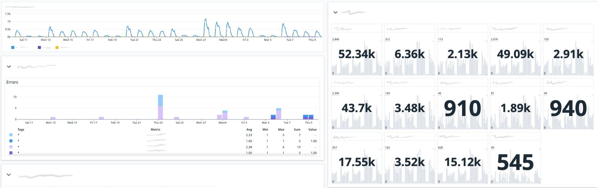
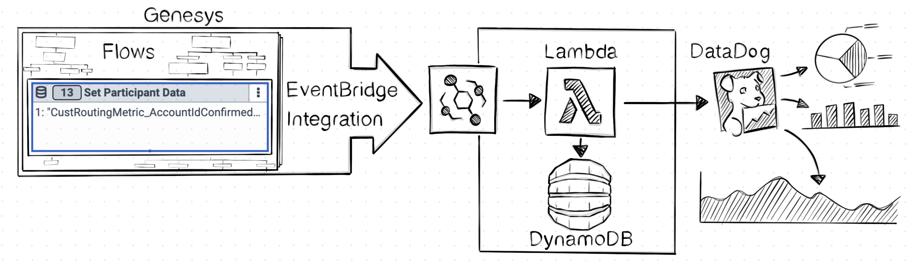
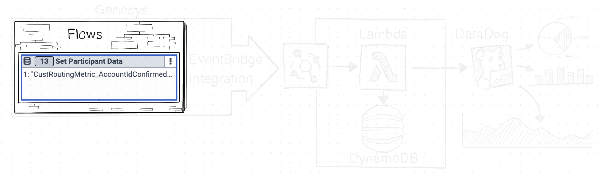
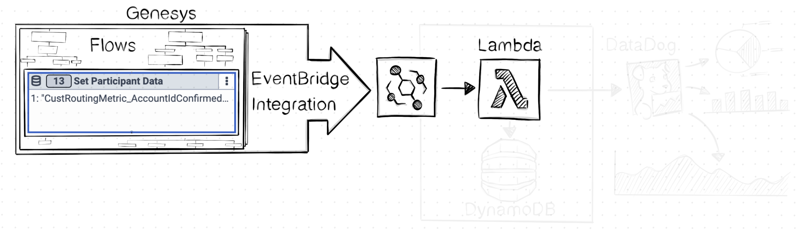
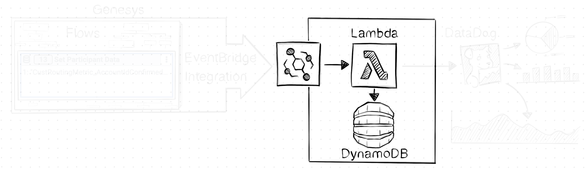
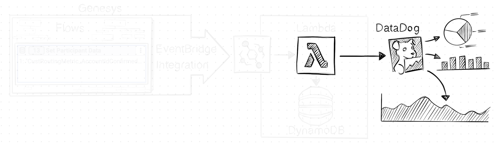

At OVO our Architect flows serve customers over 100k times a day, so making sure they work as expected is
imperative. This was my motivation for creating a tool that captures metrics from any point of a flow in realtime, and
display them in the same observability platform used by all the OVO services the flows depend on.

So far the tool has:

* Alerted us to major incidents within seconds of the first customer being affected
* Provided a realtime insight into customer behaviour across flows and chatbots
* Measured the success of A/B testing
* Detected unexpected behaviour, allowing us to pinpoint the external factors influencing customers
* Allowed all the above to be correlated to services across the business e.g. aiding us in pinpointing the service that is causing slowdown in a flow

Here's an example dashboard that leverages the metrics produced by the tool:



## How does it work?

The tool is very simple. It captures specially formatted Participant Data attributes set in flows and uses these to indicate metrics that it pushes to our observability/monitoring platform, DataDog. Once in DataDog we can create dashboards, detect anomalies, correlate metrics with other OVO services and much more...



Under the hood, the tool uses [Genesys Cloud's EventBridge Integration](https://help.mypurecloud.com/articles/about-the-amazon-eventbridge-integration/) to capture [AttributeUpdated events](https://developer.genesys.cloud/notificationsalerts/notifications/available-topics#v2-detail-events-conversation--id--attributes) which it processes with Lambdas. The Lambdas filter out these 'metric' attributes, determines which have changed using DynamoDB then pushes a custom metric to DataDog - although it could be configured to push the metrics anywhere.

It takes approx 40 seconds between capturing a new/updated attribute to the metric appearing on a dashboard. It can process over 4.5 million events a month for $40.

## Why I didn't use:

### Flow Milestones

Genesys Cloud already has a method of capturing custom metrics within a flow called [Flow Milestones](https://developer.genesys.cloud/blog/2021-06-10-flow-outcome-milestones/). However I didn't use them because:

* All our services that the Architect flows depend on also use DataDog, so being able to consolidate and correlate metrics in one place allows us to quickly detect patterns and diagnose issues
* Participant Attributes are visible Genesys Cloud's Conversation UI, so we can use these 'metric' attributes in to debug errors
* DataDog has many many features for monitoring, graphing and exploring metrics that we can now use

### Data Actions

Data Actions are the obvious choice for pushing data out of a flow, but they were't suitable for this tool for two reasons:

* [They have limits which apply to the whole organisation](https://developer.genesys.cloud/organization/organization/limits#data-actions) so shouldn't be overused
* They're visually noisy, so placing them all over your flows would create some very messy looking flows

## A deeper dive into how it works

Let's break apart the solution and provide a little more detail on how it works...

### 'Encoding' metrics in Participant Data Attributes



It all starts with the flow setting specially formatted Participant Data attributes. The format of these Attributes' names allows my code (which we'll discuss later) to discern them from the non-metric attributes:

```
Format: <Flow Name>Metric_<Metric Name>(<DateTime in UTC>)
Example: CustomerRoutingMetric_Unknown(2023-03-05T08:18:04.568Z)
```

If an attribute matches this format then it extracts the:

* Flow & Metric Name - The combination of which is unique to a flow preventing duplications across flows
* DateTime  - This ensures the attribute's name is unique, so the same metric can be set multiple times in a conversation

The value of the attribute is ignored, as the solution only counts the occurrences of metrics within time intervals.

### Capturing when Attributes are set



For my code to know that a Participant Attribute has been set, updated or deleted, I've configured [Genesys Cloud's EventBridge Integration](https://help.mypurecloud.com/articles/about-the-amazon-eventbridge-integration/) to produce [AttributeUpdated events](https://developer.genesys.cloud/notificationsalerts/notifications/available-topics#v2-detail-events-conversation--id--attributes). Upon [EventBridge](https://aws.amazon.com/eventbridge/) receiving these events it will invoke my Lambda function - more on Lambdas in the next section.

The AttributeUpdated event that my code processes contains the Conversation's ID and all the attributes associated to it, even those that didn't change since the last event.

```json
{
  // ...
  eventBody: {
    // ...
    conversationId: "12341234-1234-1234-1234-123456789012",
    attributes: {
      "CustomerRoutingMetric_Unknown(2023-03-05T08:18:04.568Z)": "1",
      "AccountID": "0-000000"
      }
  };
}
```

### Extracting the Metrics from Attributes



When the Lambda function is invoked with an Attribute Updated event (which is per conversation) my code will:

1. Extract only attributes representing metrics, based on the previously mentioned format
2. Determine which metric attributes have changed by comparing them to the previous event for the conversation, which are saved in a key-value store called DynamoDB
3. Push custom metrics to DataDog. The name of these metrics is based on the name of the metric attribute
4. Save the event to DynamoDB for determining what attributes have changed in the next event


I just mentioned two technologies, which I've described below for those who don't know them:

* [AWS Lambda](https://aws.amazon.com/lambda/) is a 'serverless, event-driven compute service that lets you run code for virtually any type of application or backend service without provisioning or managing servers'
* [AWS DynamoDB](https://aws.amazon.com/dynamodb/) is a 'fast, flexible NoSQL database service for single-digit millisecond performance at any scale'


Both of these technologies are pay-per-use, so we're only charged when they're being used. They can also scale automatically to handle traffic throughout the day.

### DataDog



The Lambda function uses DataDog's [Lambda Layer](https://docs.datadoghq.com/serverless/libraries\_integrations/extension/) to push [Custom Metrics](https://docs.datadoghq.com/metrics/custom\_metrics/) to DataDog. This layer handles the complexity of collecting and sending metrics from concurrent Lambda invocations.


The power and simplicity of DataDog does come at a price though, with custom metrics costing [approx $5 per 100 custom metrics](https://www.datadoghq.com/pricing/list/) - with a custom metric being the combination of name and tags.

## Conclusion

Thanks to Genesys Cloud's increasing integrations to other tooling, I've been able to quickly build a solution which has allowed me to continue my aim of bringing the development and monitoring of our Flows and Bots closer to that of building software.


You can read my other articles on this subject here:

* [Automating development of Genesys chatbots](https://sketchingdev.co.uk/blog/automating-development-of-genesys-chatbots.html)
* [Automate testing Genesys' Web Messenger](https://sketchingdev.co.uk/blog/automate-testing-genesys-web-messenger.html)

If you have any questions, or would like to share your implementation then I'd love to hear from you
[@SketchingDev](https://twitter.com/SketchingDev).